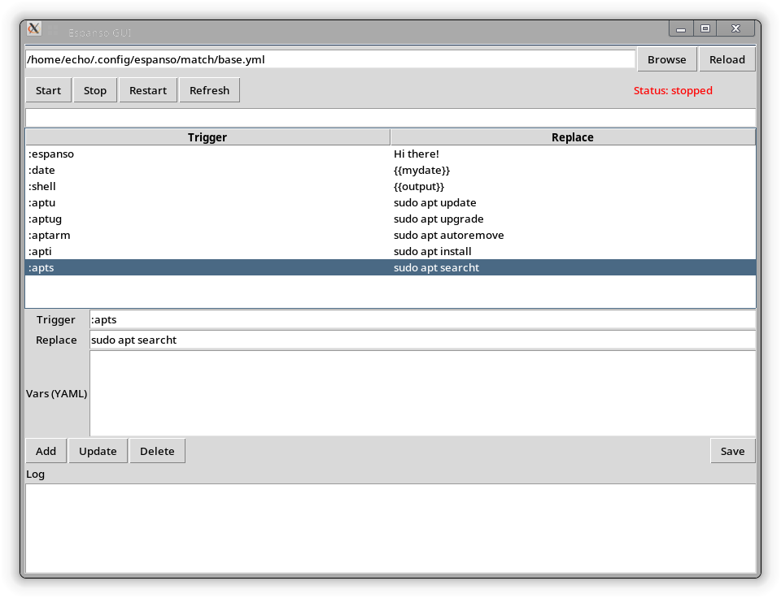

# EspansoLite

A lightweight GUI manager for Espanso (text expander) built with Python + Tkinter.

This tool allows you to:

* Manage Espanso YAML matches visually
* Start / Stop / Restart Espanso
* Search and edit triggers quickly
* View command logs

---
<p align="center">
  
</p>

## 📦 Features

* GUI-based YAML editor for Espanso
* Live filtering/search
* Start/Stop/Restart Espanso from UI
* YAML validation for `vars`
* Built-in log panel

---

## ⚙️ Requirements

* Python 3.8+
* PyYAML>=6.0
* Espanso installed

Install Espanso:
[https://espanso.org/install/](https://espanso.org/install/)

---

## 📥 Installation

```
git clone https://github.com/YOUR_USERNAME/espanso-lite.git
cd espanso-lite

python3 -m venv venv
source venv/bin/activate

pip install -r requirements.txt
python main.py
```
OR without activating:
```
~/scripts/espanso-lite-env/bin/python ~/scripts/espanso-lite/main.py
```

## 🧠 How It Works

* Loads Espanso config from:

```
~/.config/espanso/match/base.yml
```

* Displays `matches` in a table
* Allows CRUD operations on entries
* Saves directly back to YAML file

---

## 🧪 Example YAML

```
matches:
  - trigger: ":hello"
    replace: "Hello world!"

  - trigger: ":date"
    replace: "{{mydate}}"
    vars:
      - name: mydate
        type: date
```

---

## 🛠 Controls

| Button  | Function        |
| ------- | --------------- |
| Start   | Start espanso   |
| Stop    | Stop espanso    |
| Restart | Restart espanso |
| Refresh | Update status   |

---

## ⌨️ Shortcuts

| Shortcut | Action          |
| -------- | --------------- |
| Ctrl + N | Add entry       |
| Ctrl + S | Save            |
| Delete   | Delete selected |

---

## ⚠️ Notes

- Espanso should not be running as a service when using this app (uses --unmanaged mode). If you run Espanso as a service, use [mainservice.py](./mainservice.py) instead.
- Uses `espanso start --unmanaged` (see implementation in [main.py](./main.py))
- Requires the espanso binary to be available in PATH
- YAML errors in `vars` are validated (see handling in [main.py](./main.py))
---

## 🐞 Known Issues

* No schema validation for full espanso config
* Assumes `matches` key exists

---


